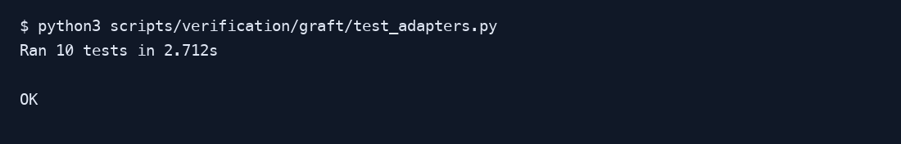
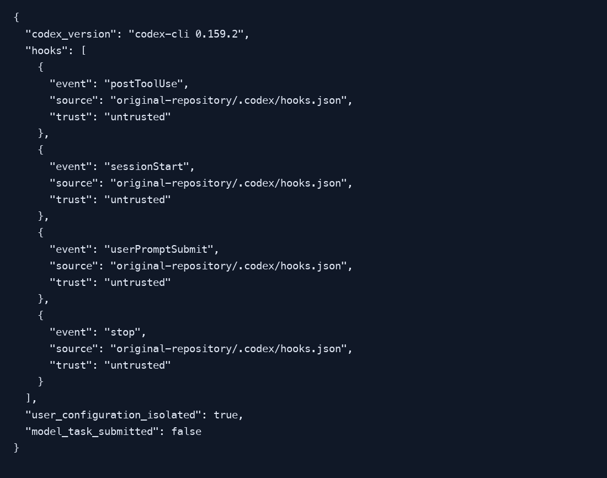

# Graft quick manual

Verified 2026-10-03 with Graft 0.21.1 and Codex CLI 0.159.2. Guarded hook/MCP adapters suppress automatic upstream initialization for the exact tested version. This manual describes repository tooling; no weather collector, database, mobile build or live provider request was run.

## 1. Install and build

Install Node 20.6 or later and the account-scoped CLI explicitly:

```sh
npm install --global @nanonets/graft@0.21.1
./scripts/build-graft.sh
graft check
graft skeleton server/controllers/controllerManager.js
graft grep WeatherUtil --fixed --in client/www/js
```

Run the build wrapper from this checkout. It reapplies the focused source scopes even after the ignored `graft/` cache is deleted. Read the architecture index first and verify relevant source before changing behavior. Native bundles and docs need ordinary source inspection.

## 2. Host setup and trust

The canonical skill is `.agents/skills/graft/`; both `.codex/skills/graft` and `.claude/skills/graft` link to it. Claude project settings load portable hooks/statusline and `.mcp.json` supplies Graft MCP. Codex config enables hooks and registers the MCP server. Restart the intended host after configuration changes.

In Codex, enter `/hooks`, select each of the four **project Graft** hooks (SessionStart, UserPromptSubmit, PostToolUse and Stop), inspect its command and press `t` to trust it. Avoid approving unrelated hooks. Trust stays in the account and is never committed. A fresh account reports these hooks as untrusted.

Codex linked worktrees discover hooks from the original checkout. That checkout needs the matching `.codex/config.toml` and `.codex/hooks.json`; the hook resolves the active Git worktree at execution time. Worktrees without the Graft shim safely skip it. See [full setup](graft.md) for supported scope, troubleshooting and upstream provenance.

## 3. Verify the setup

```sh
python3 scripts/verification/graft/test_adapters.py
python3 scripts/verification/graft/smoke.py --output reports/verification/graft-smoke
python3 scripts/verification/graft/smoke_codex_worktree.py --output reports/verification/graft-codex.json
```

The offline suite passed ten tests. Real installed-Graft smoke passed a fresh focused build, server/client queries, cache ignoring, two hook events and six MCP tools. Final smoke isolated HOME and checked that hooks/MCP changed no tracked or user files, with both absent and outdated wiring stamps. Initial smoke missed automatic wiring mutations; independent review found them and the guarded rerun corrected this. Codex discovery used an isolated account and submitted no model task. Actual CLI results are captured below as rendered text, rather than native terminal screenshots; provenance is in [the capture manifest](graft-manual-assets/manifest.json).





## 4. Troubleshoot

If `graft` is absent from PATH, the build wrapper exits 127 with install guidance; hooks silently no-op. Package lookup is bounded at 1.5 seconds. If the cache is stale, rerun the build wrapper. If a worktree has no hooks, check the original checkout configuration and restart Codex. Full Claude session execution remains a host-specific verification step; direct hook and MCP execution does not prove a Claude conversation used them.

See [selected verification evidence](../evidence/tasks/issue-2671/verification.md). Keep local raw output under ignored `reports/`; the graph is generated and must remain untracked.
