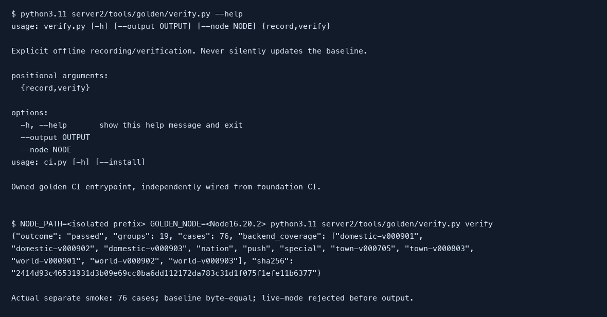

# Offline used-API golden oracle

This S02 developer tool records actual legacy handlers without starting the service, MongoDB, collectors, live providers, geocoders or notification sends. It supplies the frozen oracle for later server2 ports; it does not certify those ports or the deployed service.

## Prerequisites and safety

Use Node **16.20.2**, Python **3.11+**, and npm compatible with the checked-in lock. The legacy dependencies are deliberately pinned for this test process, not proposed as production dependencies. i18n 0.8.3, async 2.6.2 and xml2js 0.4.19 match the source baseline lock. Pinning these from the initial oracle versions changed zero body/status/header values across all 76 cases; the lock and runtime provenance still change explicitly. Work from the repository root. The isolated dependency installation uses network access to the package registry; handler execution admits only explicitly registered local 127.0.0.1 HTTP ports. Run in a clean, non-secret environment. Do not start `server/app.js` or any `/gather` endpoint.

The only outside executable is the declared `server/test/offline/golden-record.js`. The server2 consumer validates that exact canonical path and its hash, then spawns it for verification. All additional legacy source reads occur within the recorder. This manually reviewed exception is not a server2 runtime import or permission to execute arbitrary outside files.

## Verify the baseline

The independent golden CI entrypoint creates and removes a temporary dependency prefix. It installs with lifecycle scripts, audit and funding requests disabled, runs negative contract tests, and records twice in fresh Node processes:

```sh
python3.11 server2/tools/golden/ci.py --install
```

The two recordings must match each other and the checked-in `server2/tests/golden/records.json` byte for byte. A successful run reports 19 observed groups, 76 actual wire cases and 11 backend families. Missing coverage, altered raw bytes, status, headers or source/dependency hashes fails verification. The artifact keeps response bodies in base64, so JSON whitespace and non-JSON bodies are preserved.

For an existing isolated install, explicitly set its node_modules prefix and Node executable:

```sh
NODE_PATH=/tmp/my-golden-deps/node_modules \
GOLDEN_NODE=/path/to/node-16.20.2 \
python3.11 server2/tools/golden/verify.py verify
```

The following capture is from actual CLI help and a completed offline verification; host-specific paths are omitted from the capture. The PDF version contains the same procedure and evidence.



## Inspect or deliberately update a baseline

Recording requires an explicit output directory. Both consumer and direct recorder reject the committed golden directory, child paths and symlink aliases, so an explicit record cannot overwrite the baseline:

```sh
NODE_PATH=/tmp/my-golden-deps/node_modules \
python3.11 server2/tools/golden/verify.py record \
  --node /path/to/node-16.20.2 --output /tmp/my-golden-review
```

Review that output against the committed artifact, including provenance, request, raw body, status and every header. A source or fixture change requires explaining the actual contract change and independently reviewing the new recording. Copy an approved recording into the baseline only as an explicit source change, then repeat verification, placement and CI checks. The recorder pins the source baseline revision rather than using the current Git HEAD, so committing tooling does not change output.

## Coverage and interpretation

The accepted 2026-08-23..2026-09-22 UTC traffic CSV has 220,583 requests in 19 method/path groups. It establishes inclusion only. Supplementary cases exercise the real domestic v000901/v000902/v000903 and world backends, town, nation, warnings and push assembly; gateway stubs do not substitute for those cases.

All six master locales and requested temperature, wind, pressure, distance, precipitation and air unit variants execute actual controllers. Gateway success cases carry the app unit query, airForecastSource=kaq and Korean Accept-Language; a duplicate-key, plus-encoded and invalid-pair case freezes query normalization. World captures cover all six locales with an additional SI unit set. Production getJson parsing/timers execute against real registered loopback backend servers, including JSON text with a non-JSON content type. The harness injects the loopback URL; it does not execute the production host-config constructor. Cases include OPTIONS, actual ETag/304, malformed inputs, geocoder auth/quota/empty results, non-JSON gateway errors, yesterday/midnight, missing history, covered/missing/old-row POP, week-old warning types 2/3 and type 4's actual 19-hour boundary. Exactly +19 hours is included; +19 hours plus 1ms is absent in the frozen legacy behavior.

Additional cases capture actual 503/Retry-After, excluded and normalized-zero 404, the default 9-second deadline, and nation/special ETag/304. Resumed-after-eight-days input contains 24 timestamped old rows on September 15, an eight-day gap and a September 24 current slot. It is distinct from never-requested input; actual controllers decide which old rows survive.

Failure-only v000705 POST push and v000901 nation use fixed dependency failures through real handlers. The request timeout Error has code ESOCKETTIMEDOUT and no HTTP status: the nation handler returns 500, not the historical CSV 502. The cause/layer of that historical 502 is unknown; it is not a handler oracle. The push failure text is a synthetic fixture err.message, passed through by the actual handler; its literal wording is not evidence of the historical failure cause. A separate successful fixed-store POST records the legitimate 200 handler behavior. The gateway non-JSON failure body and unavailable marker are also explicitly synthetic dependency inputs.

The current v000705 town route, including its real version index, produces an empty 200 with the frozen inputs and has no ETag. Historical traffic 200 does not establish its payload. These limitations are explicit, not synthetic success fixtures.

The pinned source baseline is `f568508da68d408a282752f55614407899631c88`, including the legacy #2684 push recovery changes. AK's future server2 no-resend and new-registration-only decisions are recorded separately as intended differences; legacy goldens are not silently rewritten to encode them. Source/deployed revision drift remains a cutover gate.

## Failures and limits

A raw-body/hash error, inventory gap, source drift or byte mismatch exits nonzero. Inspect an explicit fresh recording rather than automatically accepting new bytes. Missing Node/dependencies or denied local sockets is an environment failure, not a parity result. Automated child-process tests reject live-mode hints and legacy/committed output paths before writes. Startup assertions reject unregistered/external sockets, DNS, HTTPS, UDP and child execution before IO. The consumer strips host provider/storage hints and never uses them to fetch data.

Dependency responses are fixed inputs and some existing offline fixtures are synthetic. Real assembly and HTTP middleware execute, but this does not establish provider availability, production credentials, every geographic location, concurrent locale races, complete deployed parity or a new server2 response. The JavaScript guards are a bounded verification safety mechanism, not an adversarial OS sandbox. Resource placement checks supplement manual review and do not prove arbitrary computed paths safe.

The foundation workflow retains fmt, clippy, Rust tests, placement tests, release build and separate release-binary smoke. The additive golden job invokes only its owned CI entrypoint. Essential golden bytes, selected CLI capture and this editable/PDF manual are retained in Git; raw stage runs remain ignored local reports. No broad reports upload is added.

The CI event filter is unchanged. Ordinary legacy-only maintenance does not require a server2 task declaration or run this workflow. A later golden invocation detects source drift; this oracle is not continuous legacy drift enforcement.
