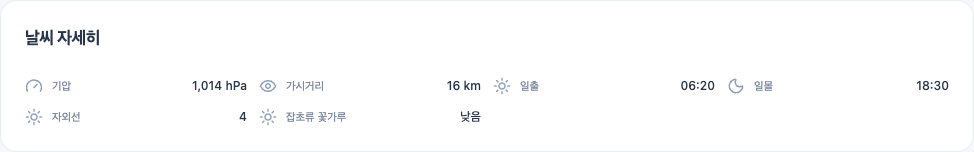
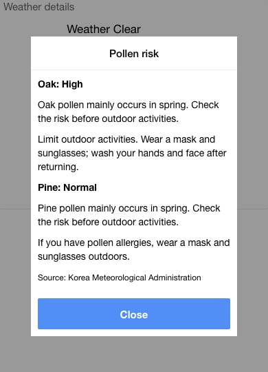
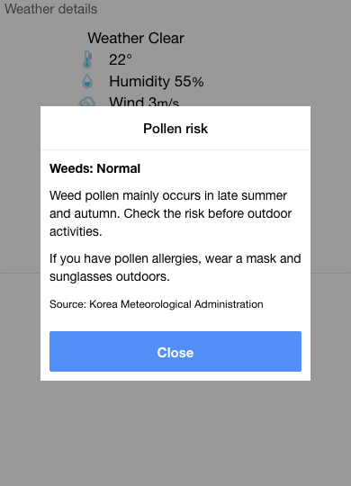
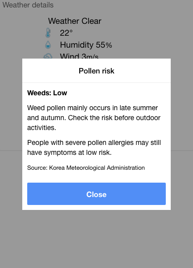
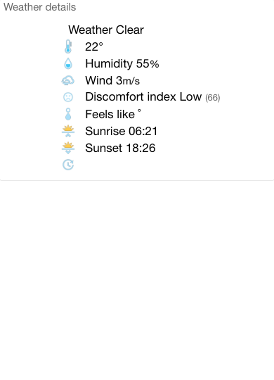

# Life indices in TodayWeather

Open a saved Korean location, then scroll to **Weather details**. TodayWeather shows the UV index and any pollen risk grades currently supplied for that location and date. The screenshot below is an actual browser run with a weather response fixture: weeds pollen is grade 0 (Low), while oak and pine were absent and therefore did not appear.

## Reading the values

The UV value is a number. Pollen grades are **Low (0)**, **Moderate (1)**, **High (2)** and **Very high (3)**. A zero grade means low risk; it does not mean missing data. TodayWeather shows oak and pine pollen during their spring publication season and weeds pollen during the late summer/autumn season, when the provider supplies a valid value. An absent item means that no usable value was supplied for the selected place and day.

These are provider indices, not a personal medical assessment. Check the weather update time before relying on a stored view. Activity suitability, food poisoning and the retired health indices are not currently offered.

The data comes from the Korea Meteorological Administration through the data.go.kr UV V5 and pollen risk V3 APIs. See [source and timing details](../rewrite/external-providers.md).

## Mobile pollen summary and detail (#2599)

In the shared mobile app, open a Korean location and scroll to **Weather details**, beside the UV item. **Pollen risk: High** means the highest grade among the types with data for today. Tap the pollen row to open its detail popup, Each available type includes a seasonal explanation and precautions for its own risk grade. Scroll the popup when needed, then choose Close to dismiss it. Keyboard users can focus the row and press Enter or Space.

In spring, Oak: High and Pine: Normal give a High summary. In autumn, Weeds: Normal alone gives a Normal summary; absent oak/pine rows do not appear. The official categories are oak (참나무), pine (소나무) and weeds (잡초류). Finer species are not classified.

Pollen is a predicted **risk index**, based on weather conditions, rather than a measured particle concentration. Its four labels are Low, Normal, High and Very high; mobile shows labels without numeric concentrations. Low is a valid grade and remains visible. If no usable pollen data exists for the place/day, the entire pollen item is absent. Provider availability determines the season; month boundaries do not force a grade.

These are actual Chromium runs of the two `client/www` Angular template tables, with isolated production v000903 responses and current shared SCSS compiled against Ionic. They do not establish a Cordova build, live provider result or production rollout. [Capture provenance](images/pollen-mobile/provenance.json) records all eight TodayWeather/TodayAir scenarios. TodayAir is retired; its shared template is verified only for compatibility. The existing web view described above continues to show individual types. The [PDF guide](life-index.pdf) covers the new mobile scenarios.

Reproduce: run `server/test/offline/pollen-route-smoke.js` with isolated dependencies and `TZ=UTC`, writing `POLLEN_CAPTURE`; compile `client/scss/ionic.app.scss` using the Ionic SCSS assets; run `scripts/verification/pollen-client-smoke.cjs` with that capture and `POLLEN_CSS`; render the PDF with `scripts/verification/pollen-manual-pdf.py` (ReportLab). Browser dependencies and Chromium are prerequisites; native widgets are outside scope.

Precautions paraphrase the [KMA four-grade guidance (April 2019, pollen risk table)](https://www.kma.go.kr/download_01/kma_201904.pdf): allergy symptoms can occur even at Low; Normal recommends a mask and sunglasses for allergy sufferers; High recommends limiting outdoor activity and washing after returning; Very high recommends staying indoors where possible and keeping windows closed. These are general precautions, not species-level diagnoses.
